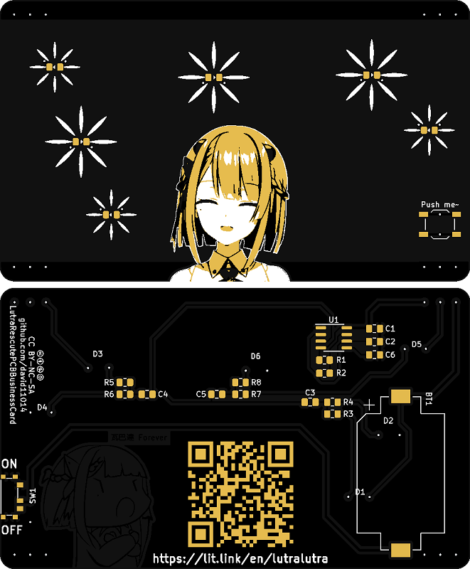

# LutraRescutePCBBusinessCard

# Intro

瀕臨絕種團露恰露恰的 PCB 名片，靈感來自以下直播內容
[【魔女之家#2】見習小魔女水獺的新家大冒險🍻【露恰露恰．Vtuber】](https://youtu.be/RvgKsK7jW5E?t=4198)

感謝[春魚工作室](https://t.co/JhnwOmfZGn)與[里歐](https://twitter.com/leo_chen0912/status/1580262135908945920)授權使用圖片

This is a PCB business card of LutraLutra, the idea is inspired by the blow live video [【魔女之家#2】見習小魔女水獺的新家大冒險🍻【露恰露恰．Vtuber】](https://youtu.be/RvgKsK7jW5E?t=4198).

Thanks to [春魚工作室](https://t.co/JhnwOmfZGn) and [里歐](https://twitter.com/leo_chen0912/status/1580262135908945920) for the permission to use image.

# BOM
|Ref                     |Qnty |Value        |Footprint                                                  |Description                                     |Vendor                             |
|------------------------|-----|-------------|-----------------------------------------------------------|------------------------------------------------|-----------------------------------|
|BT1,                    |1    |Battery_Cell |Battery:BatteryHolder_Keystone_1060_1x2032                 |Single-cell battery                             |https://ok.100y.com.tw/Goods/52684 |
|C1,                     |1    |0.1uF        |Capacitor_SMD:C_0805_2012Metric_Pad1.18x1.45mm_HandSolder  |Unpolarized capacitor                           |https://ok.100y.com.tw/Goods/99587 |
|C2, C3, C4, C5,         |4    |10uF         |Capacitor_SMD:C_0805_2012Metric_Pad1.18x1.45mm_HandSolder  |Unpolarized capacitor                           |https://ok.100y.com.tw/Goods/42857 |
|C6,                     |1    |0.001uF      |Capacitor_SMD:C_0805_2012Metric_Pad1.18x1.45mm_HandSolder  |Unpolarized capacitor                           |https://ok.100y.com.tw/Goods/124188|
|D1, D2, D3, D4, D5, D6  |6    |LED          |Img:LED_0805_2012Metric_Pad1.15x1.40mm_HandSolder          |Light emitting diode                            |https://ok.100y.com.tw/Goods/99164 |
|R1, R2,                 |2    |100K         |Resistor_SMD:R_0805_2012Metric_Pad1.20x1.40mm_HandSolder   |Resistor                                        |https://ok.100y.com.tw/Goods/123451|
|R3, R4, R5, R6, R7, R8, |6    |2K           |Resistor_SMD:R_0805_2012Metric_Pad1.20x1.40mm_HandSolder   |Resistor                                        |https://ok.100y.com.tw/Goods/123312|
|SW1,                    |1    |SW_DPDT_x2   |Img:Switch_MSK-01A                                         |Switch, dual pole double throw, separate symbols|https://ok.100y.com.tw/Goods/139685|
|SW2,                    |1    |SW_Push      |Button_Switch_SMD:SW_SPST_TL3342                           |Push button switch, generic, two pins           |https://ok.100y.com.tw/Goods/98045 |
|U1,                     |1    |LMC555CM/NOPB|Package_SO:SOIC-8_3.9x4.9mm_P1.27mm                        |CMOS Timer, 555 compatible, SOIC-8              |https://ok.100y.com.tw/Goods/56713 |

# License

 本著作係採用<a rel="license" href="http://creativecommons.org/licenses/by-nc-sa/4.0/">創用 CC 姓名標示-非商業性-相同方式分享 4.0 國際 授權條款</a>授權.
